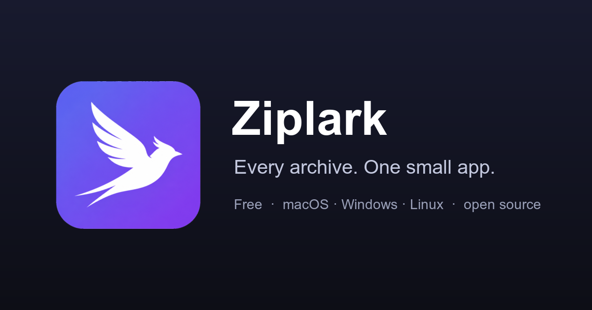

<div align="center">

<a href="https://ziplark.com"></a>

[](https://github.com/zhitongblog/ziplark/actions/workflows/ci.yml)
[](https://github.com/zhitongblog/ziplark/releases/latest)
[](https://github.com/zhitongblog/ziplark/releases)
[](https://github.com/zhitongblog/ziplark/stargazers)
[](LICENSE)
[](https://ziplark.com)

**Free, fast, cross-platform archiver.** Extracts ZIP, RAR (incl. RAR5), 7z,
tar, ISO and the common compressed-tar variants; creates ZIP (with AES-256), 7z
and tar archives. One small Rust engine, three ways to drive it: a desktop app,
a CLI, and an MCP server.

[**Download**](https://ziplark.com/#download) · [Website](https://ziplark.com) · [Report a bug](https://github.com/zhitongblog/ziplark/issues)

</div>

## Install

```bash
# macOS — Homebrew
brew install --cask zhitongblog/tap/ziplark   # desktop app
brew install zhitongblog/tap/ziplark          # CLI + MCP (ziplark, ziplark-mcp)
```

```powershell
# Windows — Scoop (CLI + MCP)
scoop bucket add ziplark https://github.com/zhitongblog/scoop-bucket
scoop install ziplark
# winget (pending review): winget install zhitongblog.Ziplark
```

Or grab a build for any platform from the [releases page](https://github.com/zhitongblog/ziplark/releases/latest)
(macOS `.dmg`, Windows `.msi`/`.exe`, Linux `.deb`/`.AppImage`, and CLI archives).

| | Read / Extract | Create | Encryption |
|---|:---:|:---:|---|
| ZIP | ✅ | ✅ | AES-256 (read ZipCrypto) |
| 7z | ✅ | ✅ | AES-256 |
| RAR / RAR5 | ✅ | — | reads encrypted |
| tar | ✅ | ✅ | — |
| tar.gz / .bz2 / .xz / .zst / .lz4 | ✅ | ✅ | — |
| gz / bz2 / xz / zst / lz4 (single stream) | ✅ | ✅ | — |
| ISO 9660 / Joliet (disc image) | ✅ | — | — |

> RAR and ISO are extract-only: RAR's compression format is proprietary, and ISO
> is a disc-image container (we read ISO 9660 + Joliet with our own dependency-free
> parser). Everything else can be created as well as read.

## Why Ziplark
- **Small.** Size-optimized release profile (`opt-level=z`, LTO, stripped,
  `panic=abort`). The desktop app uses the OS webview (no bundled Chromium).
- **Safe.** Every extraction path is funneled through a single zip-slip guard —
  no entry can ever escape the destination directory.
- **One engine.** The GUI, CLI and MCP server are thin shells over
  [`ziplark-core`](crates/ziplark-core); whatever the CLI does, the app does
  identically.

## Repository layout
```
crates/ziplark-core   the archive engine (all formats, the security guard)
crates/ziplark-cli    the `ziplark` command-line tool
crates/ziplark-mcp    the MCP server (drive Ziplark from any LLM)
src-tauri           the Tauri 2 desktop app (Rust commands)
ui                  the desktop frontend (vanilla HTML/CSS/JS)
```

## 1. Desktop app

```bash
# dev run (opens the window)
cargo tauri dev            # or: cargo run -p ziplark-gui

# build a release .app + .dmg (macOS), .exe/.msi (Windows), AppImage/deb (Linux)
cargo tauri build
```
Drag an archive onto the window to inspect & extract it, or switch to **Create**
to drag in files/folders, pick a format + compression level (and optional
password), and save.

## 2. CLI — `ziplark`

```bash
cargo build --release -p ziplark-cli      # binary at target/release/ziplark

ziplark list  movie.rar
ziplark extract photos.zip -o ./out
ziplark create backup.tar.zst ./src ./README.md --level best
ziplark create secret.zip ./private --password hunter2
ziplark test  download.7z
ziplark info  mystery.bin
```
Every command takes `--json` for scripting. `--include <PAT>` filters entries on
extract; `--level store|fast|default|best` and `--password` apply to create.

### Right-click (file-manager) integration

Add **Extract here with Ziplark** and **Compress to ZIP with Ziplark** to your
OS file manager's context menu:

```bash
ziplark shell-integration install      # enable
ziplark shell-integration status       # show what's installed
ziplark shell-integration uninstall    # remove
```

Per platform: **macOS** installs two Automator Quick Actions (Finder → right-click →
Quick Actions); **Windows** adds per-user (`HKCU`, no admin) shell verbs on archive
file types and on files/folders; **Linux** installs KDE service menus and Nautilus
scripts. Every entry just calls the `ziplark` CLI (`extract-here` / `compress-zip`),
so it follows wherever the binary lives. Both helper commands are also usable
directly:

```bash
ziplark extract-here movie.zip         # → ./movie/ next to the archive
ziplark compress-zip ./photos ./a.txt  # → ./Archive.zip next to them
```

## 3. MCP server — `ziplark-mcp`

A Model Context Protocol server (JSON-RPC over stdio). Read tools
(`ziplark_info`, `ziplark_list`, `ziplark_test`) are always available; the write tools
(`ziplark_extract`, `ziplark_create`) require `--allow-write`.

```bash
cargo build --release -p ziplark-mcp
```
Register it with an MCP client:
```json
{
  "mcpServers": {
    "ziplark": {
      "command": "/path/to/target/release/ziplark-mcp",
      "args": ["--allow-write"]
    }
  }
}
```

## Building & testing
```bash
cargo test                 # engine round-trip + security tests
cargo build --release      # all crates, size-optimized
```

## License
GPL-3.0. Free as in freedom.
